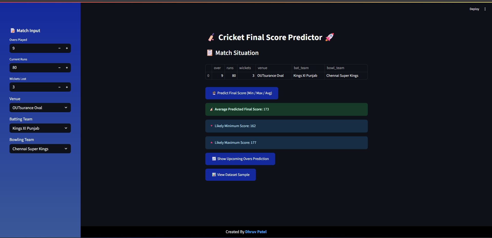
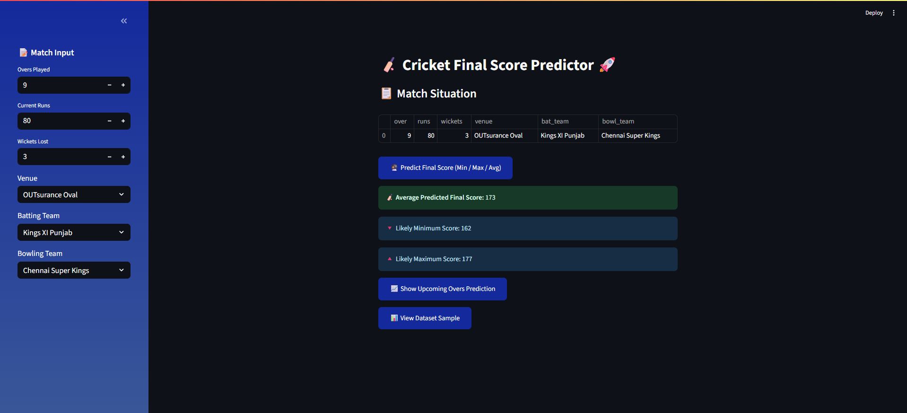
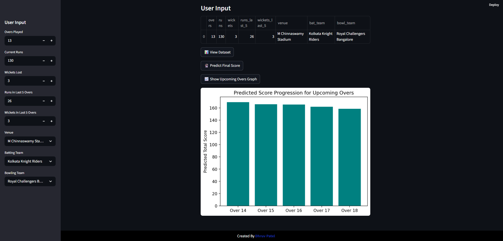

<h1 style="font-size:50px">🏏 Cricket Match Score Prediction System 🚀</h1>    


## Table of Contents
- [Overview](#overview)
- [Features](#features)
- [Installation](#installation)
- [Usage](#usage)
- [Preview](#preview)
- [Model](#model)
- [URLs](#urls)
- [Contributing](#contributing)
- [License](#license)
- [Contact](#contact)

---

# 📌 Overview
A machine learning-powered web application to **predict final cricket scores** based on:
- Current runs, overs played, wickets lost
- Batting team, bowling team, venue
- Smart features: run rate, projected score, pressure factor, death overs flag

✨ Built using Python, scikit-learn, and Streamlit.  
🌐 **Live Demo:** [cricketscorepredictionsystem.streamlit.app](https://cricketscorepredictionsystem.streamlit.app/)

---

# ✨ Features
✅ Predicts realistic final cricket scores (average, min & max)  
✅ Shows upcoming overs prediction as bar graph  
✅ Clean, modern, mobile-friendly UI  
✅ View sample dataset  
✅ Lightweight, fast, easy to deploy anywhere

---

# ⚙ Installation (Step-by-Step)

## ✅ Step 1: Clone the repository
```bash
git clone https://github.com/dhruvpatel16120/Cricket-Score-Prediction-System.git
cd Cricket-Score-Prediction-System
```

---

## ✅ Step 2: Create & activate virtual environment

#### 🪟 **Windows**
```bash
python -m venv env
env\Scripts\activate
```

#### 🐧 **Linux / macOS**
```bash
python3 -m venv env
source env/bin/activate
```

---

## ✅ Step 3: Install dependencies
```bash
pip install -r requirements.txt
```

---

## ✅ Step 4: Train the ML model
```bash
python train_model.py
```

> ⚠️Saves model & preprocessor to `data/` folder 


## ✅ Step 5: Run the Streamlit app
```bash
streamlit run Cricket-Score-Prediction.py
```
### ✅  Then open your browser
>go to [http://localhost:8501](http://localhost:8501)

---

# 📂 **Project Structure**
```
📂 data/
   ├── ipl.csv               # Cleaned IPL dataset
   ├── best_model.pkl        # Trained ML model
   └── preprocessor.pkl      # Saved preprocessor
📂 preview/                   # Screenshots for README
train_model.py               # Model training script
Cricket-Score-Prediction.py  # Streamlit app
requirements.txt
README.md
LICENSE
.gitignore
```

---

# 🚀 Usage
1. **Train the model:**
```bash
python train_model.py
```

2. **Run the Streamlit app:**
```bash
streamlit run Cricket-Score-Prediction.py
```

3. **Open your browser:**  
Go to [http://localhost:8501](http://localhost:8501)

---

# 📸 Preview of Web APP

| 🏏 Main UI | 📊 Prediction Output |
|:--:|:--:|
|  |  |

| 📈 Upcoming Overs Graph | 📂 View Dataset |
|:--:|:--:|
|  |  |

> ⚠️ Screenshots stored in `preview/` folder) 

---

# 🤖 Model
- **Gradient Boosting Regressor** (lightweight, fast, robust)
- One-Hot Encoding for teams & venue
- Standard scaling for numerical features
- Smart derived features:
  - `current_run_rate`
  - `projected_score`
  - `pressure_factor`
  - `is_death_overs`

---

# 🌐 URLs
- **🚀 Live App:** [cricketscorepredictionsystem.streamlit.app](https://cricketscorepredictionsystem.streamlit.app/)
- **📦 GitHub Repo:** [Cricket-Score-Prediction-System](https://github.com/dhruvpatel16120/Cricket-Score-Prediction-System)
- **🧑‍💻 Portfolio:** [dhruvpatelofficial.vercel.app](https://dhruvpatelofficial.vercel.app)

---

# 🤝 Contributing  


Contributions, ideas, bug reports and improvements are always welcome! 🚀

To contribute to this project:

1. **Fork the repository**  
   Click the **Fork** button at the top right of this page.

2. **Clone your fork locally**:
   ```bash
   git clone https://github.com/dhruvpatel16120/Cricket-Score-Prediction-System.git
   cd Cricket-Score-Prediction-System
   ```

3. **Create a new branch**:
   ```bash
   git checkout -b feature-branch
   ```

4. **Make your changes**

5. **Commit your changes**:
   ```bash
   git commit -m "Add: meaningful description of your change"
   ```

6. **Push to your fork**:
   ```bash
   git push origin feature-branch
   ```

7. **Open a Pull Request**  
   Go to your fork on GitHub → click **"Compare & pull request"** → describe your changes → **Create pull request**.

✅ **Tips for great contributions:**
- Follow the existing code style & formatting
- Add helpful comments where needed
- Update `README.md` if you add or change features
- Test everything locally before submitting

⭐ *Thank you for helping improve this project! Your contribution makes it better for everyone.* 🌱✨

---
# 📄 License
 + This project is licensed under the **MIT License** – see [LICENSE](LICENSE).
---

# ✏ Contact 
**Created by:** [Dhruv Patel](https://dhruvpatelofficial.vercel.app)

> ⭐ Star the repo if you like it!  
> 💡 Feedback & suggestions are welcome!
---
